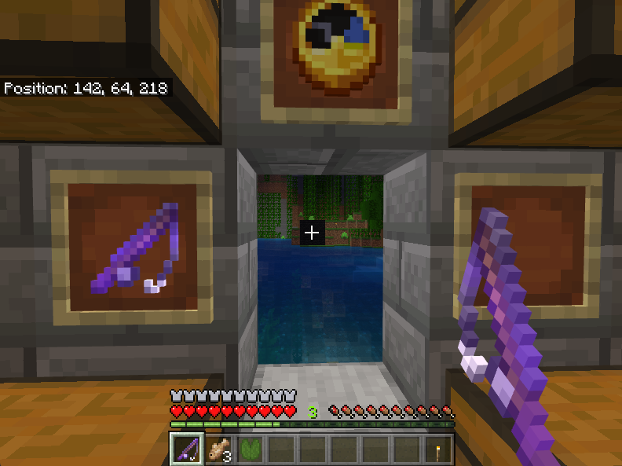
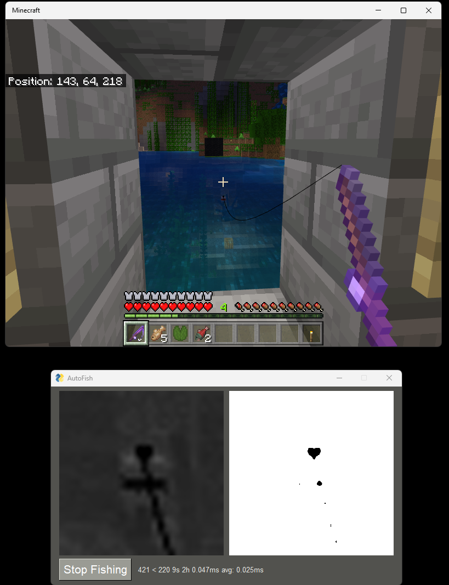
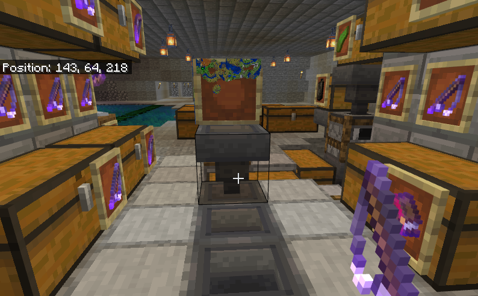
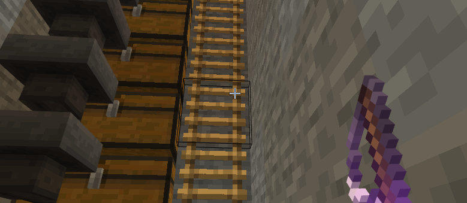
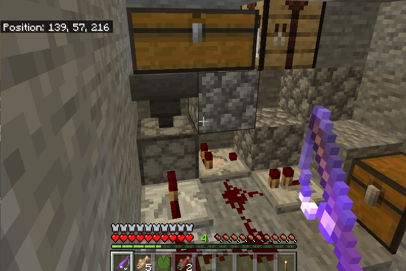
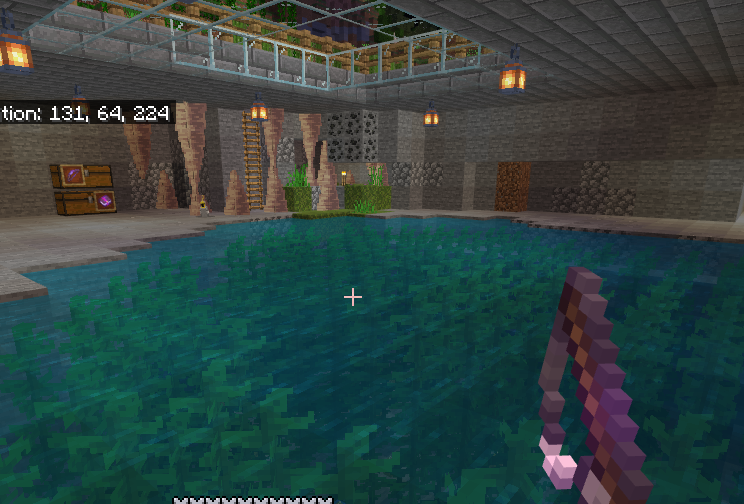

# minecraft-auto-angler

A toy project to automate fishing in minecraft.

Why?

1. It's an easy source of XP. Unlike a mob farm, fishing doesn't decrease hunger. 
2. You get treasure enchants. Hello "Mending I" books!
3. It impresses my kids. 

## How to Use

When you start AutoAngler, simply click "Start Fishing" or press F12. You have 5 seconds to focus on minecraft and 
position the crosshair over your target. The software will attempt to find the cursor. It helps to have a 3x3 black wool 
target during the day as the opencv location method has trouble with the difference in light level. This is the template 
that opencv uses: . I plan to fix this in a future version.

Once the cursor is located, the software will cast and reel automatically. You must position your cursor 
so that when it casts the bobber is right above the bobber. You can see the bobber in the preview window. 

The image on the right shows you what the computer is looking for. The bobber and line contain pure black.
When a fish is on the line, the bobber is dropped out of the preview. This is when the software will reel.

The threshold is hardcoded right now. In the future, I hope to make it dynamic to account for light level changes or at 
least make it configurable. If you are missing fish, you might need to adjust the bobber lower in the preview window. 

From within minecraft to release the cursor you must hit ESC. This also stops fishing. 

F10 will exit the software. 

## Tips

Place a backstop behind you with a hopper and chest. It doesn't take long to overflow your inventory.

Add overflow protection if you want to run it overnight. I've filled 9 chests before.

An [auto-dropper](https://www.sportskeeda.com/minecraft/how-make-automatic-item-dropper-minecraft) that drops on cactus 
or lava serves as a time saving trash can. 

One of the treasures you can catch while fishing are enchanted rods. You want Lure III, Luck of the Sea III, and 
Mending. If you fish long enough, you'll catch a dozen of the OP rods.

If you are fishing inside to the outside, be sure to put a half-slab in front of you. This prevents you 
from inadvertently falling or getting knocked out of the opening and drowning.

If you are fishing inside, you want to make sure you're fishing in "open water" there shouldn't be any 
blocks within a 5x5 box centered around the bobber. If you want the rain bonus, then the rain must hit the 
bobber. You can find out more on the [Minecraft Wiki](https://minecraft.fandom.com/wiki/Fishing).

You'll end up catching a ton of enchanted books, bows, and rods. Even if you don't need them, keep them. Think of them 
as XP batteries. When you are ready to enchant something, you just strip off the XP in a grindstone. 

## Credits

The detection method was based on this article: 
[Let’s Go Fishing! Writing a Minecraft 1.17 Auto-Fishing Bot in Python, OpenCV and PyAutoGUI](https://medium.com/geekculture/lets-go-fishing-writing-a-minecraft-1-17-auto-fishing-bot-in-python-opencv-and-pyautogui-6bfb5d539fcf) 