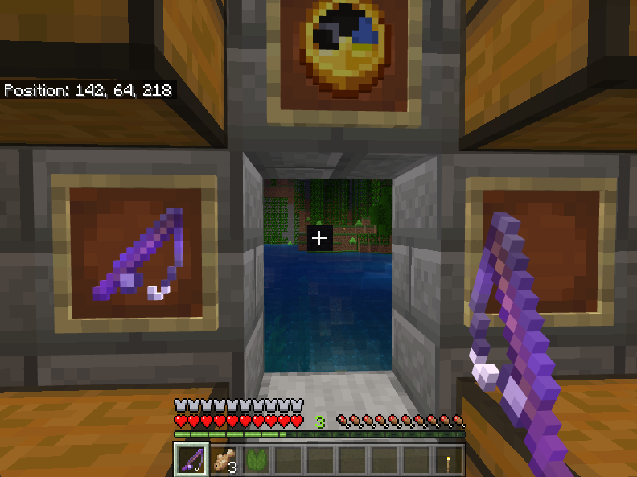
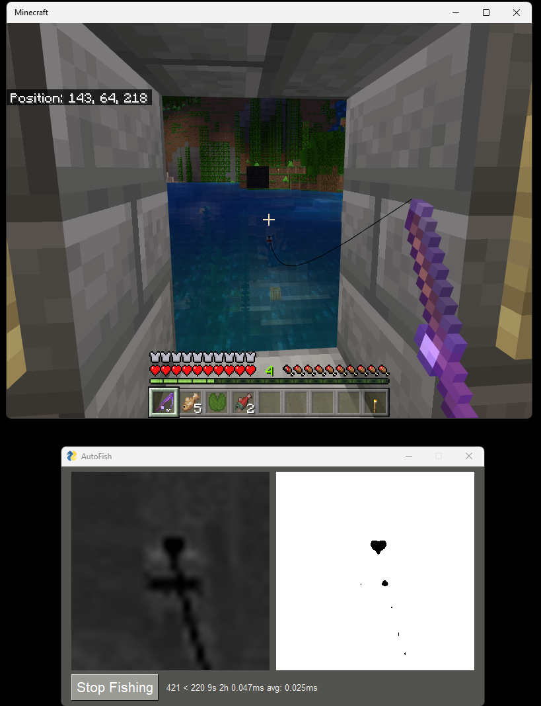
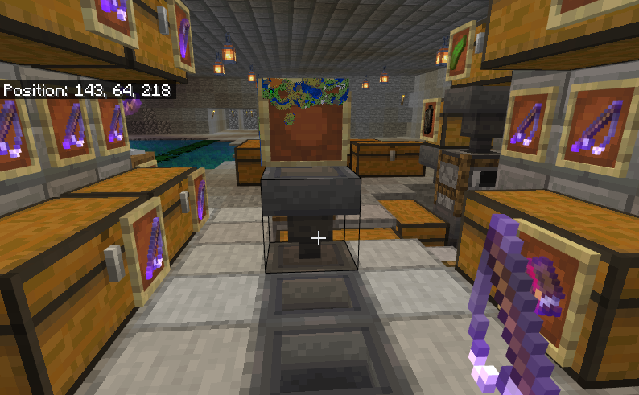
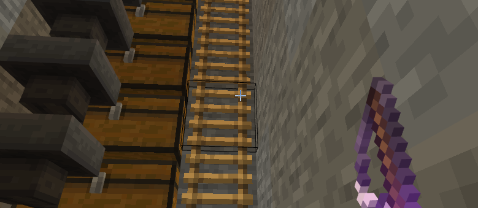
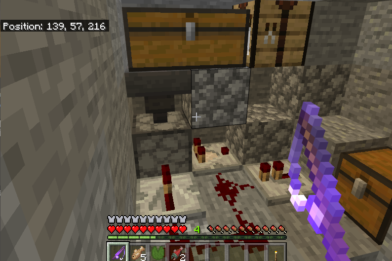
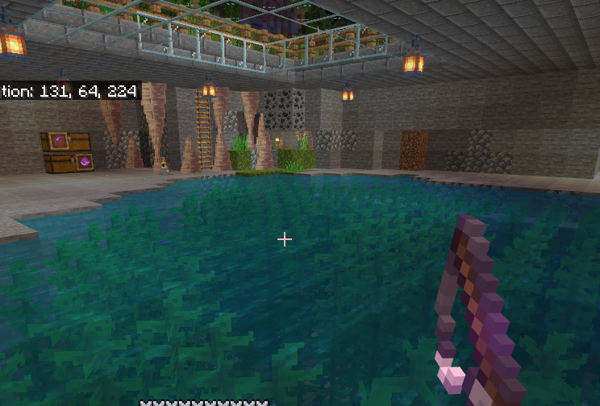

# minecraft-auto-angler

A tool for automating, observing, and analyzing Minecraft fishing.

Why?

1. It's an easy source of XP. Unlike a mob farm, fishing doesn't decrease hunger. 
2. You get treasure enchants. Hello "Mending I" books!
3. It impresses my kids. 

## Features

- Auto-locates the Minecraft Java window, calibrates the fishing ROI, and refreshes that context when the window moves or resizes.
- Detects bites from the bobber area with a vision pipeline that tracks line pixels, maintains a rolling reference, and checks rod state when the line is in.
- Supports optional macOS audio bite hints through a ScreenCaptureKit-based helper so audio splashes can be logged alongside vision detections.
- Presents a compact Tk operator UI with a live ROI preview, fishing and recording indicators, bite feedback, a catch counter, and a toggleable debug window.
- Keeps operator controls close at hand with hotkeys for cast or reel, recording, training marks, recalibration, debug view, and fishing start or stop.
- Records per-session artifacts under `~/.autoangler/sessions/`, including PNG captures, raw window video, debug video, and mark clips around manual labels.
- Writes structured telemetry for profiling and review, including per-tick timing CSVs, detector trace CSVs, periodic `PROFILE` log lines, and audio-hint metadata.
- Ships offline analysis tools to inspect a single frame, summarize a recorded session profile, replay a session against detector settings, and collect flame graphs.
- Exposes timing controls for cast settle and recast delays, plus a selectable screen-capture backend for comparison or fallback testing.

## Setup and run

Install [uv](https://docs.astral.sh/uv/) (e.g. `curl -LsSf https://astral.sh/uv/install.sh | sh`), then from the repo root:

```bash
uv sync
uv run python -m autoangler
```

Example run with explicit timing ranges and audio hints:

```bash
uv run python -m autoangler \
  --cast-settle-min-ms 2800 \
  --cast-settle-max-ms 3200 \
  --recast-min-ms 300 \
  --recast-max-ms 1000 \
  --audio-hints
```

Optional (recommended for contributors):

```bash
uv sync --group dev
```

Experimental macOS audio probe:

```bash
uv run python -m autoangler.audio_probe --title-hint Minecraft
```

This probe uses ScreenCaptureKit to target Minecraft app audio and prints `BITE_CANDIDATE` lines when
it sees a strong transient that looks like a fishing splash. It is macOS-only. When you launch the Tk
app with `--audio-hints`, AutoAngler starts the helper in the background and records audio hints
alongside the vision detector for the same session.

Legacy launcher (kept for backward compatibility):

```bash
cd auto-angler && uv run python auto-angler.py
```

Note: this project now uses `tkinter`. If you see `ModuleNotFoundError: No module named '_tkinter'`, install a Python
distribution with Tk support (common fix on macOS when using `asdf`: `brew install tcl-tk@8` then reinstall Python).
Screen capture now defaults to `mss`. To force the old Pillow capture path for comparison or fallback, launch with
`AUTOANGLER_CAPTURE_BACKEND=pil`.

macOS permissions: this project uses screen capture and input control. You may need to enable permissions for the app
you launch it from (Terminal, iTerm, VS Code, etc.) in System Settings → Privacy & Security:

- Accessibility (needed for global hotkeys and input control)
- Input Monitoring (needed for global hotkeys via `pynput`)
- Screen Recording (needed for screenshots via `PIL.ImageGrab`)

The experimental audio probe also depends on the same macOS screen/system-audio capture permission path
because ScreenCaptureKit is what provides application audio.

## How to Use

When AutoAngler starts, it tries to locate the Minecraft Java window and calibrate the fishing ROI automatically.
If you move or resize Minecraft, AutoAngler re-runs that locate/calibrate step on the fly. You can also force a manual
refresh with `F9`.

The main window is now a compact operator view:

- a single ROI preview with the tracking overlays
- a blinking red recording indicator
- a green fishing-active indicator
- a bite indicator
- a bite-based catch counter
- only `FPS` and `tick` timing on the top row

The preview border turns green when the current phase has a usable signal and red when the context looks stale or the
expected signal is missing. When the line is out, that validation comes from the calibrated detection region. When the
line is in, it comes from the rod-state check.

Use these hotkeys while fishing:

- `F7` toggle recording
- `F8` manual action: cast when the line is in, reel/recast when the line is out, and log the detector as `hit` or `miss` when reeling
- `F9` manual locate + calibrate
- `F10` show or hide the debug window
- `F12` start or stop fishing
- `ESC` stop fishing
- `Cmd+Q` exit AutoAngler

Use the `View` menu to toggle `Always On Top` and to open the debug window without using hotkeys.
The app restores its last window position and always-on-top preference on launch.
The main window also includes an `Auto-Strafe` checkbox. When enabled, AutoAngler wanders between casts with larger bounded left/right movement plus a slight bounded mouse drift, both anchored back toward the session-start aim.

While recording is armed, AutoAngler writes these artifacts into a per-run folder under `~/.autoangler/sessions/<session>/`:

- periodic PNG captures
- a whole-window raw video (`...-window.mp4`)
- a debug composite video (`...-debug.mp4`)



Once the window is located, the software casts and reels automatically. Line the cast up so the fishing line and splash
area sit inside the calibrated tracking box. The main preview shows only the ROI with the tracked overlays, not the full
Minecraft window. The default ROI is biased toward the lower-right portion of the Minecraft window because the cast
target and rod tend to stay there when the camera is fixed.



The debug window shows the full-window overlay, the processed mask, and the formatted debug stats. Dark line pixels stay
black against a white background in the processed view. When those dark pixels drop sharply inside the scored box,
AutoAngler treats that as a bite and reels.

The bite trigger now uses a rolling reference from the calibrated tracking box instead of one hardcoded pixel threshold.
If it still misses fish, recalibrate with `F9` after the line lands. Cast settle time and reel-to-recast time come
from CLI-configured ranges, and recast defaults now randomize from `300ms` to `1000ms`.

The debug window shows the current ROI, tracking box, scored detection box, rod state, capture failures, last artifact
names, and the detailed profiling line (`fps`, tick, capture, detect, preview, record, top stage, RSS memory`). While
preview capture is active, AutoAngler writes a per-session `...-profile.csv` with those stage timings and runtime
timing metadata. While fishing, it also emits periodic `PROFILE ...` log lines. While recording is armed, AutoAngler
writes a per-session trace CSV with line pixels, trigger threshold, weak-frame count, bite decisions, timing metadata,
scheduled delays, audio hint values, auto-strafe events, action source, training labels, and catch count so you can
correlate missed bites against the captured frames. For denser PNG capture during testing, set
`AUTOANGLER_RECORD_INTERVAL_MS` before launch. To change how often profile summaries are logged, set
`AUTOANGLER_PROFILE_LOG_INTERVAL_S`.

To summarize a session profile and its trigger sequence, run
`uv run python -m autoangler.profile_session /path/to/session-profile.csv`.

To cap how often AutoAngler submits new screen-capture work, set
`AUTOANGLER_MAX_CAPTURE_FPS` before launch. The default cap is `10`.

To capture a sampling-profiler flame graph for a live run, use
`./scripts/profile_flamegraph.sh /path/to/output-flame.svg`.
If you omit the path, it writes to `~/.autoangler/flamegraph.svg`.

To inspect a frame offline with the current detector, run
`uv run python -m autoangler.analyze_image /path/to/frame.png`.
It writes a crop, processed mask, overlay, and JSON summary next to the image.

To replay a recorded session against a detector configuration and append a JSON-LD experiment result, run
`uv run python -m autoangler.experiment_harness /path/to/session.log --trace /path/to/session-trace.csv --box x1,y1,x2,y2`.
Results append to `~/.autoangler/experiment-log.jsonld` by default.

To append a capture-backend benchmark entry from a session profile, run
`uv run python -m autoangler.experiment_harness /path/to/session.log --profile /path/to/session-profile.csv --backend mss`.
Use `--backend pil` when logging a Pillow comparison run.

From within minecraft to release the cursor you must hit ESC. This also stops fishing. 

## Tips

Place a backstop behind you with a hopper and chest. It doesn't take long to overflow your inventory.



Add overflow protection if you want to run it overnight. I've filled 9 chests before.



An [auto-dropper](https://www.sportskeeda.com/minecraft/how-make-automatic-item-dropper-minecraft) that drops on cactus 
or lava serves as a time saving trash can. 



One of the treasures you can catch while fishing are enchanted rods. You want Lure III, Luck of the Sea III, and 
Mending. If you fish long enough, you'll catch a dozen of the OP rods.

If you are fishing inside to the outside, be sure to put a half-slab in front of you. This prevents you 
from inadvertently falling or getting knocked out of the opening and drowning.

If you are fishing inside, you want to make sure you're fishing in "open water" there shouldn't be any 
blocks within a 5x5 box centered around the bobber. If you want the rain bonus, then the rain must hit the 
bobber. You can find out more on the [Minecraft Wiki](https://minecraft.fandom.com/wiki/Fishing).

You'll end up catching a ton of enchanted books, bows, and rods. Even if you don't need them, keep them. Think of them 
as XP batteries. When you are ready to enchant something, you just strip off the XP in a grindstone. 



## TODO

- Handle squid interference in the fishing ROI so wandering mobs do not look like bite activity.

## Credits

The detection method was based on this article: 
[Let’s Go Fishing! Writing a Minecraft 1.17 Auto-Fishing Bot in Python, OpenCV and PyAutoGUI](https://medium.com/geekculture/lets-go-fishing-writing-a-minecraft-1-17-auto-fishing-bot-in-python-opencv-and-pyautogui-6bfb5d539fcf) 
